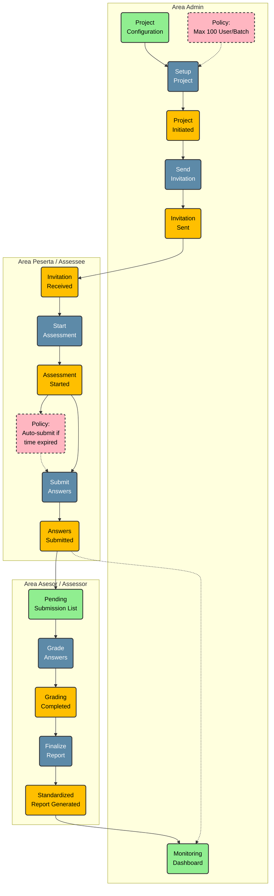

# Event Storming: Assessment Application Flow

Diagram ini menggambarkan alur aplikasi assessment yang melibatkan 3 aktor: **Admin**, **Peserta (Assessee)**, dan **Asesor (Assessor)**.

## Legenda Warna (Event Storming Standard)
- **Biru (Command):** Aksi/Perintah yang dilakukan user (contoh: "Submit Jawaban").
- **Oranye (Event):** Fakta yang terjadi setelah command berhasil (contoh: "Jawaban Terkirim").
- **Pink (Policy):** Aturan bisnis atau logika otomatis (contoh: "Jika nilai < 70, gagal").
- **Hijau (Read Model/View):** Informasi yang dilihat user untuk mengambil keputusan.

